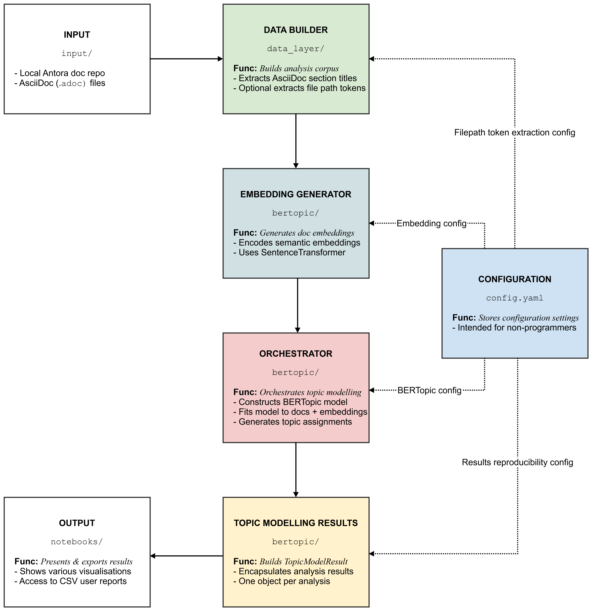

# Antora Repository Topic Modelling EDA Tool

***

## <mark>Portfolio Repository Notice</mark>

*This repository documents a software project that I conceptualised, designed and developed to solve an operational challenge within a client organisation's software technical documentation team. The implementation source code and test suite are not publicly available because the project originated from work undertaken in a commercial environment. The repository is therefore a portfolio repository containing only the project's documentation and testing evidence (see the `docs` folder).*

***

## 1. Overview

The Antora Repository Topic Modelling Exploratory Data Analysis (EDA) Tool is a reproducible, configuration-driven topic modelling tool for analysing Antora-based documentation repositories using section titles as a proxy for information architecture.

The tool enables documentation teams to understand, evaluate, and improve repository structure using data-driven insights by extracting section titles from `.adoc` files and applying the BERTopic algorithm to identify latent themes across a documentation repository.

The tool's goal is not content analysis, but structural analysis. This approach surfaces how information is currently organised, identifies fragmented or duplicated topics, highlights cross-cutting concerns, and supports decisions for repository restructuring.

The tool features a pipeline that preserves file-level traceability, ensuring every topic can be mapped back to its source documents, i.e., the original `.adoc` files.

***

## 2. Key Features

The tool is designed to be reproducible, configurable, performant, and experiment-friendly. Its key features include section title–driven analysis, file-level traceability, Antora-aware processing, a configurable NLP pipeline, optional context enrichment, an automated pipeline, and rich outputs.

| Feature                         | Description                                                                                                                     |
|---------------------------------|---------------------------------------------------------------------------------------------------------------------------------|
| *Section Title–Driven Analysis* | Focuses on section headings rather than the prose content, using them as a proxy for the repository's information architecture. |
| *File-Level Traceability*       | Maintains a mapping between file paths, modules, and topics, enabling direct linkage between insights and source files.         |
| *Antora-Aware Processing*       | Recognises and leverages Antora repository conventions to accurately extract module names and file path tokens.                 |
| *Configurable NLP Pipeline*     | NLP components are fully controlled via a dedicated, user-friendly configuration file, `config.yaml`.                           |
| *Optional Context Enrichment*   | Can include file path tokens as additional signals, improving clustering when naming is consistent.                             |
| *Automated Pipeline*            | Orchestrates the entire process from repository traversal to topic modelling, ensuring a streamlined and reproducible workflow. |
| *Rich Outputs*                  | Generates CSV datasets, visualisations, and metrics for exploration and any further downstream analysis.                        |

***

## 3. System Architecture

### a. Project Structure

The high-level directory structure of the project is as follows:

  ```text
  antora-repo-topic-modelling-eda-tool/
  ├── notebooks/
  │   └── topic_modelling_workbench.ipynb
  ├── src/
  │   └── antora_repo_topic_modelling_eda_tool/
  │       ├── bertopic/
  │       ├── data_layer/
  │       ├── input/
  │       ├── output/
  │       └── utils/
  ├── tests/
  │   ├── fixtures/
  │   ├── unit/
  │   ├── integration/
  │   └── conftest.py
  ├── resources/
  │   ├── domain_stop_words.txt
  │   └── models/
  │       └── sentence_transformers/
  ├── output/
  │   └── results_<repo>_<branch>_<random_state>_<timestamp>/
  ├── docs/
  ├── .env.example
  ├── config.yaml
  ├── pyproject.toml
  └── README.md
  ```

### b. System Flow

The system flow outlines the sequential steps the tool takes to process an Antora repository, extract relevant information, and perform topic modelling.

The steps are outlined below:

1. Make an Antora documentation repository available on the local file system.
2. Discover and process `.adoc` documents.
3. Extract AsciiDoc section titles and construct the topic-modelling document corpus.
4. Optionally, augment the document text with relevant file path tokens.
5. Encode the documents as semantic embeddings using a SentenceTransformer model.
6. Construct a configurable BERTopic model using:
   - SentenceTransformer embeddings;
   - CountVectorizer for tokenisation, n-grams, and configured stop-word handling;
   - UMAP for dimensionality reduction; and
   - HDBSCAN for clustering.
7. Fit and transform the BERTopic model using the document corpus and precomputed embeddings.
8. Obtain topic and probability assignments.
9. Construct a TopicModelResult object containing the resulting topic-modelling data.
10. Analyse, validate, augment, visualise, and write the resulting information.

The user only has to provide the path to the local Antora repository and configure the desired parameters in `config.yaml`. The tool will handle the rest of the process automatically.

### c. High-level System Architecture

The diagram below illustrates the high-level system architecture.



### d. Design Philosophy

- *Structure over Content*: The tool intentionally ignores body content to reduce noise, maintain a lightweight, performant pipeline, and focus on author intent encoded in headings.
- *Traceability First*: Every topic assignment links back to a file path, preserves auditability, and supports actionable refactoring.
- *Notebook as Interface*: The notebook serves as the user interface for interacting with the system, but all core logic resides in the `src/` directory.

***

## 4. Configuration

The project features a central configuration file, `config.yaml`, that defines all adjustable parameters for the topic modelling pipeline.

The configurable options are tabulated below.

| Option                             | Description                                                |
|------------------------------------|------------------------------------------------------------|
| `INCLUDE_RELEVANT_FILEPATH_TOKENS` | Whether to include file path tokens as additional signals. |
| `COUNT_VECTORIZER_PARAMETERS`      | Parameters for the CountVectorizer component.              |
| `BERTOPIC_PARAMETERS`              | Parameters for the BERTopic component.                     |
| `SENTENCE_TRANSFORMER_MODEL_NAME`  | Name of the sentence transformer model to use.             |
| `ENCODE_PARAMETERS`                | Parameters for the encoding process.                       |
| `RANDOM_STATE`                     | Fixed random state for reproducibility.                    |
| `UMAP_PARAMETERS`                  | Parameters for the UMAP component.                         |
| `HDBSCAN_PARAMETERS`               | Parameters for the HDBSCAN component.                      |
| `INCLUDE_DOMAIN_STOP_WORDS`        | Whether to include domain-specific stop words.             |
| `DOMAIN_STOP_WORDS_FILE_PATH`      | File path to the domain-specific stop words list.          |

***

## 5. Setup

### a. Install prerequisites

- **VS Code** is recommended.

- **Python 3.10+:**
  - Install the `Python` extension for Visual Studio Code.
  - Press `Ctrl+Shift+P` and enter `Python: Create Environment` in the command palette.
  - You may choose `Quick Create venv` at this point to create a virtual environment at the workspace root and install the workspace dependencies needed to run the application and its unit tests in one go, completing the installation. Alternatively, choose `venv` as the environment manager, then continue with the remaining steps below to create a virtual environment and install dependencies manually.
  - Specify a Python interpreter. For example, `Python 3.14.6`.
  - Enter a name for the virtual environment. You may use the default: `.venv`.
  - Select `Install project dependencies` as found in the dependency files.
  - Tick the boxes for `pyproject.toml`, `dev`, and `notebook` as packages to install and click 'OK', or run the command below to install dependencies manually.

  ```bash
    pip install -e ".[dev,notebook]"
  ```

### b. Configure environment

Create a `.env` file based on the provided `.env.example` file::

  ```text
  REPOSITORY_PATH=/path/to/local/antora/repo
  ```

### c. Configure the pipeline

Edit `config.yaml` as required by adjusting clustering sensitivity, enabling file path token enrichment, adding domain-specific stop words, etc.

### d. Download sentence transformer model

Set up the sentence transformer model for embeddings:

- Download the `all-MiniLM-L6-v2` model from [Sentence Transformer Model Download](https://public.ukp.informatik.tu-darmstadt.de/reimers/sentence-transformers/v0.2/).
- Place and unzip the model's contents in:

  ```text
  resources/models/sentence_transformers/
  ```

***

## 6. Running the Topic Modelling Workbench

1. Open the notebook:

    ```text
    notebooks/topic_modelling_workbench.ipynb
    ```

2. Execute all cells, i.e., `Run All`, in the notebook interface.

***

## 7. Outputs

Each run generates a timestamped folder:

```text
output/results_<repo>_<branch>_<random_state>_<timestamp>/
```

### a. Data Outputs

- `topic_modelling_results_<repo>_<branch>.csv`
  - file_path
  - module
  - section_titles
  - topic
  - probability
  - topic keywords

- `topic_summary_<repo>_<branch>.csv`

- `topic_spread_<repo>_<branch>.csv` (messiness score)

### b. Visualisations

- Topic keyword summary
- Topic distribution bar chart
- Module vs topic heatmap
- Topic confidence distribution
- BERTopic topic map
- Document clustering view
- Topic hierarchy
- Topic similarity matrix

### c. Analytical Metrics

- *Topic Spread ("Messiness Score")*: Measures how fragmented a topic is across modules.
- *Representative Documents per Topic*: Concrete examples for interpretation (output in the notebook).

***

## 8. Interpreting Results

Use outputs to answer questions such as:

- Which topics dominate the repository?
- Which topics are fragmented across modules?
- Where do duplicate or overlapping themes exist?
- Which Antora modules contain mixed or unclear concerns?

These insights support content consolidation, module restructuring, and improved navigation design, and provide a basis for evidence-based decision-making in documentation management.

***

## 9. Testing

The project includes unit and integration tests to verify the pipeline's correctness and reliability. The unit tests validate individual components, while the integration tests exercise interactions between the machine learning components and supporting configuration.

### a. Running Tests

To run the tests:

1. Ensure you are in the project root directory.
2. Run the command below to execute all tests:

    ```bash
    pytest
    ```

### b. Generating Coverage Reports

To run all the tests and generate a coverage report:

  ```bash
  pytest --cov
  ```

For an HTML coverage report, run:

  ```bash
  pytest --cov --cov-report html
  ```

### c. Selective Test Execution

The `pyproject.toml` file also registers `unit` and `integration` pytest markers to facilitate selective test execution using:

```bash
pytest -m unit
pytest -m integration
```

## 10. When to Use This Tool

The tool excels in the scenarios outlined below.

- A documentation repository has grown organically.
- Navigation feels inconsistent or duplicated.
- You need evidence-based restructuring decisions.
- Stakeholders require quantifiable insights.

***

## 11. Limitations

- The tool relies on the quality of section titles, which, depending on perspective, can be seen as a strength because well-chosen and consistent headings improve topic modelling accuracy, but on the flipside, means that poorly chosen or inconsistent headings can negatively impact the results.
- It is neither intended nor suitable for semantic content analysis.

***

## 12. Additional Resources

- [BERTopic](https://maartengr.github.io/BERTopic/)
- [Scikit-learn CountVectorizer](https://scikit-learn.org/stable/modules/generated/sklearn.feature_extraction.text.CountVectorizer.html)
- [SentenceTransformers](https://www.sbert.net/)
- [Sentence Transformer Model Download](https://public.ukp.informatik.tu-darmstadt.de/reimers/sentence-transformers/v0.2/)
- [Antora Documentation](https://antora.org/)
